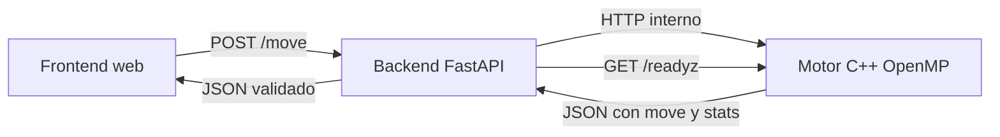

# 01 - Arquitectura

## Vision general

La solucion se organiza como una aplicacion distribuida pequena, formada por tres servicios con responsabilidades separadas. El servicio `motor` es un proceso C++17 independiente que implementa las reglas de Kalah(6,4), ejecuta busqueda Alfa-Beta y usa OpenMP para paralelizar la evaluacion de los movimientos de la raiz. El servicio `backend` es una API FastAPI que valida el contrato publico, aplica CORS explicito y delega el calculo al motor por HTTP dentro de la red del despliegue. El servicio `frontend` es una interfaz web estatica servida por Nginx que permite editar el tablero, escoger jugador, profundidad e hilos, y visualizar la jugada recomendada junto con estadisticas.

Esta separacion es intencional. El motor concentra el costo computacional y puede escalarse, medirse y optimizarse sin mezclarlo con logica web. El backend actua como frontera de entrada para navegadores y clientes externos: valida JSON con Pydantic, traduce errores del motor a codigos HTTP y expone endpoints de salud para Docker, Kubernetes y CI. El frontend no contiene logica de IA; solamente construye solicitudes y presenta respuestas. Asi se evita que una parte de la aplicacion tenga que conocer detalles internos de otra.



## Contrato de comunicacion

El contrato principal es `POST /move`. El cliente envia un tablero de 14 posiciones, el lado activo, la profundidad de busqueda y el numero de hilos solicitados. El backend valida que el tablero tenga exactamente 14 enteros no negativos, que el total de semillas sea 48, que `side` sea `0` o `1`, que `depth` este entre `1` y `32`, y que `threads` este entre `1` y `64`. Despues envia el mismo JSON al motor en `MOTOR_URL`.

Ejemplo de entrada:

```json
{
  "board": [4,4,4,4,4,4,0,4,4,4,4,4,4,0],
  "side": 0,
  "depth": 8,
  "threads": 4
}
```

Ejemplo de salida:

```json
{
  "move": 3,
  "evaluation": 7,
  "elapsed_ms": 124,
  "stats": {
    "nodes": 1845210,
    "prunes": 312083
  },
  "threads_used": 4
}
```

El campo `move` usa indices absolutos del arreglo canonico. Para jugador 0 los pits legales son `0..5`; para jugador 1 los pits legales son `7..12`. Esta decision reduce ambiguedades entre servicios: todos hablan en la misma representacion.

## Endpoints

El backend expone cuatro endpoints minimos:

- `GET /healthz`: confirma que el proceso FastAPI vive.
- `GET /readyz`: confirma que el backend puede contactar al motor real.
- `GET /metrics`: publica metricas de backend y, si esta disponible, concatena metricas del motor.
- `POST /move`: valida la solicitud y delega el calculo al motor.

El motor expone endpoints equivalentes para que el backend y Kubernetes puedan verificarlo: `GET /healthz`, `GET /readyz`, `GET /metrics` y `POST /move`. El motor no es un modulo importado por Python; es un proceso separado. En Docker Compose, el backend lo alcanza con `http://motor:9000`. En Kubernetes, lo alcanza con el Service interno `motor` por el puerto `9000`.

## Decisiones de diseno

La primera decision fue mantener el backend delgado. En versiones tempranas habia un camino simulado controlado por una variable de entorno; ese camino se elimino de la ruta principal porque ocultaba fallas del motor y podia aprobar pruebas superficiales sin cumplir el requisito distribuido. Ahora, si el motor no responde, readiness falla y `/move` devuelve `503`. Este comportamiento es mas honesto operacionalmente y ayuda a detectar problemas de despliegue.

La segunda decision fue usar HTTP simple entre backend y motor. gRPC tambien era viable, pero habria requerido mas generacion de codigo y dependencias. HTTP con JSON es suficiente para el contrato pequeno del proyecto, facilita pruebas con `curl`, simplifica healthchecks y encaja bien con FastAPI y Kubernetes. En el motor C++ se implemento un servidor HTTP minimo sin dependencias externas para evitar que el build dependa de paquetes no disponibles en el entorno del profesor.

La tercera decision fue mantener el frontend estatico. No se requiere un framework pesado para enviar un JSON, pintar un tablero y mostrar metricas. Nginx sirve `index.html`, `style.css` y `app.js`, lo que reduce el tiempo de build y elimina una fuente de fallas por dependencias de Node. La interfaz usa el backend local por defecto y, en nube, puede resolver un host `api.<dominio>` para separar frontend y API.

## Despliegue y escalabilidad

En local, Docker Compose levanta los tres servicios y usa healthchecks para ordenar el arranque. En Kubernetes local y nube se declaran Deployments, Services, ConfigMap, probes y recursos. El backend tiene al menos 3 replicas, cumpliendo el requisito de balanceo. El motor puede tener 2 replicas porque cada solicitud es independiente: no hay estado compartido entre busquedas. Si el trafico crece, se escala horizontalmente el backend para absorber conexiones y el motor para absorber calculo.

La escalabilidad vertical del motor se controla con `threads`. Cada solicitud decide cuantos hilos usar, pero el contenedor tambien define `OMP_NUM_THREADS` como valor operativo por defecto. En ambientes compartidos no conviene permitir que todas las replicas usen mas hilos que CPUs disponibles; por eso los manifiestos incluyen `requests` y `limits` de CPU y memoria. Esa declaracion ayuda al scheduler de Kubernetes a ubicar pods y evita que un benchmark agresivo ahogue otros procesos.

## Observabilidad

El backend cuenta solicitudes totales y solicitudes `/move`. El motor cuenta solicitudes HTTP, busquedas, nodos, podas y tiempo acumulado. Las metricas se exponen en texto estilo Prometheus para que puedan leerse directamente o conectarse a un scraper. En un proyecto mas grande se agregarian histogramas por profundidad y por hilos, pero para esta entrega el foco esta en demostrar que el calculo real se ejecuta y que el paralelismo produce datos comparables.

## Riesgos de arquitectura

El principal riesgo es que una profundidad alta con muchos hilos puede tardar mas de lo esperado si el tablero tiene alto factor de ramificacion. Para mitigarlo, el backend tiene timeout configurable y el motor valida limites de profundidad e hilos. Otro riesgo es que el frontend de nube necesite el dominio final para CORS; por eso los origenes se cargan desde `CORS_ORIGINS` y no se usa `"*"`. Finalmente, la implementacion HTTP del motor es deliberadamente pequena; es adecuada para el proyecto, pero no reemplaza un framework de produccion con TLS, streaming y control avanzado de concurrencia.
