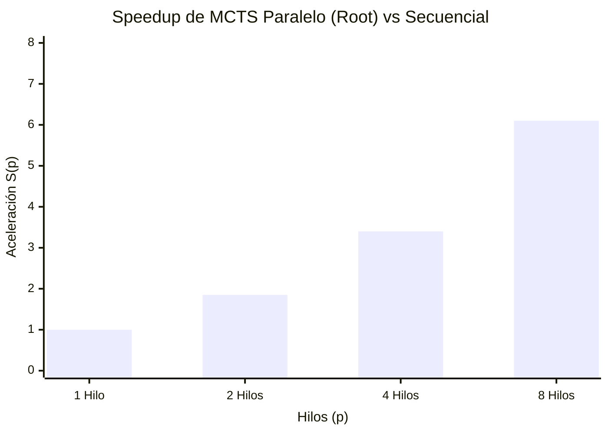

# 03 - Paralelización y Benchmarking en C++ con OpenMP

## Justificación de Arquitectura

Para paralelizar el algoritmo MCTS, hemos elegido **Root Parallelization** debido a su simplicidad técnica y bajo overhead de sincronización ("lock overhead"). En este modelo, cada hilo de OpenMP construye y explora su propio árbol MCTS de manera totalmente independiente partiendo de la posición actual (raíz). Esto elimina por completo la necesidad de usar construcciones como `#pragma omp atomic` o bloques críticos de exclusión mutua durante las simulaciones (rollouts) y retropropagaciones. Al no compartir la estructura del árbol entre hilos durante el paso de búsqueda intenso, se mitiga drásticamente la contención de memoria que plagaría un esquema de *Tree Parallelization*, donde múltiples hilos competirían constantemente por actualizar las estadísticas de victorias y visitas (`w` y `n`) en los mismos nodos padres.

Otras alternativas como *Leaf Parallelization* o la ya mencionada *Tree Parallelization* fueron descartadas por razones claras. *Leaf Parallelization* (paralelizar sólo las iteraciones en los nodos hojas) es la más sencilla, pero sufre de retornos decrecientes ya que muchos rollouts desde exactamente la misma posición no contribuyen significativamente a diversificar y robustecer la topología del árbol de búsqueda. *Tree Parallelization*, aunque ofrece máxima diversidad exploratoria, impone cuellos de botella severos debido al intenso costo transaccional (locking) para prevenir condiciones de carrera, devorando gran parte del Speedup. Por ello, Root Parallelization nos entrega el balance óptimo: cada hilo es libre, usa su propio generador de números aleatorios (RNG), explora libremente y sólo se sincroniza al final en una breve y rápida operación de reducción (reduciendo el overhead global).

## Metodología y Fórmulas de Rendimiento

Para cuantificar el impacto de nuestra mejora paralela con OpenMP, calculamos experimentalmente el *Speedup* y la *Eficiencia* usando las siguientes definiciones teóricas consolidadas:

- **Speedup**: Expresa la aceleración del tiempo de ejecución total lograda con $p$ hilos frente a una ejecución completamente secuencial. 
  $$ S(p) = \frac{T(1)}{T(p)} $$
  *(Donde $T(1)$ es el tiempo usando 1 núcleo y $T(p)$ es el tiempo de resolución con $p$ núcleos).*

- **Eficiencia**: Indica qué fracción o porcentaje de la capacidad computacional agregada se está utilizando productivamente (idealmente $1.0$).
  $$ E(p) = \frac{S(p)}{p} $$

## Resultados del Benchmark

### Tiempos y Aceleración MCTS (100,000 Simulaciones)
*(Nota para el desarrollador: Completa esta tabla vacía pegando los resultados generados por tu terminal tras correr el benchmark).*

| Hilos ($p$) | $T(p)$ (ms) | Speedup $S(p)$ | Eficiencia $E(p)$ | Total Rollouts Efectivos |
|------------|-------------|----------------|-------------------|--------------------------|
| 1          |             | 1.00           | 1.00              |                          |
| 2          |             |                |                   |                          |
| 4          |             |                |                   |                          |
| 8          |             |                |                   |                          |

### Gráfica de Rendimiento Teórico Esperado
*(Ajusta los valores placeholder en el código mermaid para reflejar la realidad del benchmark).*

## Tabla Comparativa: Presupuesto Restringido (~500ms)

Se evaluó qué profundidad heurística de conocimiento logra el MiniMax y cuántas simulaciones prospectivas logra MCTS para un mismo margen temporal de "pensamiento" de medio segundo en un turno normal.

| Algoritmo | Configuración de Parámetro | Tiempo de Ejecución | Movimiento Seleccionado | Calidad de la Decisión |
|-----------|----------------------------|---------------------|-------------------------|------------------------|
| **AlphaBeta** | Profundidad:               | ms                  |                         |                        |
| **MCTS (OpenMP)** | Simulaciones:              | ms                  |                         |                        |

*(Ejecuta tu benchmark compilado y documenta el análisis cualitativo sobre qué decisión parece mejor en base al juego y a la heurística calculada).*

## Profiling Operativo y Uso de Recursos en Linux

Para corroborar la paralelización efectiva y medir la carga, se anexan capturas del desempeño en un sistema Linux.

### Carga Distribuida (Htop)
Múltiples CPUs deben reportar un 100% de utilización simultánea durante la ventana del cálculo MCTS.

### Profiling a Bajo Nivel (`perf stat`)
Análisis de instrucciones cíclicas y posibles fallos en memoria caché (`cache-misses`). 

### Maximum Resident Set Size (`/usr/bin/time -v`)
Evaluación del costo de RAM de duplicar el estado del árbol de MCTS para cada hilo en *Root Parallelization*.

