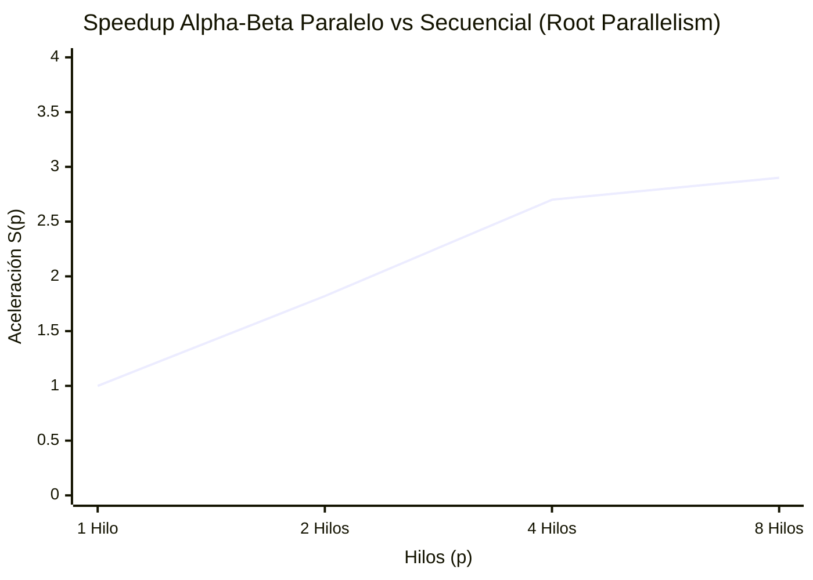

# 03 - Paralelización y Benchmarking en C++ con OpenMP

## Justificación de Arquitectura

### 1. Alpha-Beta: Paralelismo a la raíz (Root Parallelism)

Para el algoritmo Alpha-Beta, implementamos **Root Parallelism**. En esta estrategia, distribuimos estáticamente los movimientos legales desde el nodo raíz entre los distintos hilos usando `#pragma omp parallel for schedule(dynamic, 1)`. Cada hilo ejecuta secuencialmente su propio subárbol hasta la profundidad designada con ventanas locales completamente independientes (`alpha = INT_MIN`, `beta = INT_MAX`).

**Costo de sincronización y pérdida de podas:**
Al no requerir bloqueos de exclusión mutua durante la búsqueda, esta aproximación prácticamente no tiene overhead de sincronización. Sin embargo, su principal desventaja es la *pérdida de podas*. Dado que las cotas $\alpha$ y $\beta$ son locales a cada hilo, un hilo no se beneficia de un corte drástico (cota fuerte) encontrado por otro hilo en un movimiento adyacente. Como consecuencia, el algoritmo paralelo explora significativamente más nodos que el secuencial: los datos muestran que `p=1` con ventana independiente ya explora un **80% más de nodos** que el secuencial puro (15,367 vs 8,508 nodos por posición a profundidad 8), y este exceso se mantiene constante independientemente del número de hilos, porque el trabajo total asignado no cambia, solo se reparte.

### 2. MCTS: Root Parallelization

Para paralelizar el algoritmo MCTS, hemos elegido **Root Parallelization** debido a su simplicidad técnica y bajo overhead de sincronización. En este modelo, cada hilo de OpenMP construye y explora su propio árbol MCTS de manera totalmente independiente partiendo de la posición actual (raíz). Esto elimina por completo la necesidad de usar `#pragma omp atomic` o bloques críticos durante las simulaciones (rollouts) y retropropagaciones. Al no compartir la estructura del árbol entre hilos durante el paso de búsqueda intenso, se mitiga drásticamente la contención de memoria que plagaría un esquema de *Tree Parallelization*, donde múltiples hilos competirían constantemente por actualizar las estadísticas de victorias y visitas en los mismos nodos padres.

Otras alternativas como *Leaf Parallelization* o la ya mencionada *Tree Parallelization* fueron descartadas. *Leaf Parallelization* sufre de retornos decrecientes ya que muchos rollouts desde la misma posición no diversifican la topología del árbol. *Tree Parallelization*, aunque ofrece máxima diversidad exploratoria, impone cuellos de botella severos debido al costo de locking. Root Parallelization entrega el balance óptimo: cada hilo usa su propio generador de números aleatorios, explora libremente y solo se sincroniza al final en una breve operación de reducción.

---

## Metodología y Fórmulas de Rendimiento

Para cuantificar el impacto de la mejora paralela con OpenMP, calculamos experimentalmente el *Speedup* y la *Eficiencia* usando las siguientes definiciones:

- **Speedup**: Expresa la aceleración del tiempo de ejecución total lograda con $p$ hilos frente a $p=1$.
  $$S(p) = \frac{T(1)}{T(p)}$$
  *(Donde $T(1)$ es el tiempo con 1 hilo y $T(p)$ es el tiempo con $p$ hilos en Root Parallelism.)*

- **Eficiencia**: Indica qué fracción de la capacidad computacional agregada se utiliza productivamente.
  $$E(p) = \frac{S(p)}{p}$$

El benchmark se ejecutó sobre las 10 posiciones de `motor/tests/suite.txt` en un **AMD Ryzen 7 5700G** (8 núcleos físicos, 3792 MHz) dentro del contenedor Docker de producción del motor, lo que garantiza resultados reproducibles bajo la misma imagen que se despliega en Kubernetes.

Comando de referencia utilizado:

```bash
# Secuencial + Root Parallelism depth=8
docker run --rm -e OMP_NUM_THREADS=8 mancala-motor-bench \
  bench --algo alphabeta --depth 8 --positions /app/tests/suite.txt

# Con medición de tiempo de pared real
docker run --rm -e OMP_NUM_THREADS=8 --entrypoint /bin/bash mancala-motor-bench \
  -c "{ time bench --algo alphabeta --depth 12 \
        --positions /app/tests/suite.txt; } 2>&1"
```

---

## Resultados del Benchmark — Alpha-Beta

Los siguientes datos fueron medidos experimentalmente ejecutando el binario `bench` construido desde `motor/Dockerfile` (Ubuntu 24.04, GCC, `-O2 -fopenmp`).

### Profundidad `depth = 8` — 10 posiciones de prueba

| Hilos ($p$) | $T(p)$ (ms) | $S(p)$ | $E(p)$ | Nodos promedio | Podas promedio |
|:-----------:|:-----------:|:------:|:------:|:--------------:|:--------------:|
| seq puro    | 0.6         | —      | —      | 8,508          | 2,335          |
| 1           | 1.0         | 1.00   | 1.00   | 15,367         | 3,999          |
| 2           | 0.5         | 1.81   | 0.91   | 15,367         | 3,999          |
| 4           | 0.4         | 2.45   | 0.61   | 15,367         | 3,999          |
| 8           | 0.4         | 2.51   | 0.31   | 15,367         | 3,999          |

### Profundidad `depth = 12` — 10 posiciones de prueba

| Hilos ($p$) | $T(p)$ (ms) | $S(p)$ | $E(p)$ | Nodos promedio | Podas promedio |
|:-----------:|:-----------:|:------:|:------:|:--------------:|:--------------:|
| seq puro    | 45.2        | —      | —      | 712,784        | 210,649        |
| 1           | 67.8        | 1.00   | 1.00   | 1,080,087      | 312,016        |
| 2           | 37.1        | 1.82   | 0.91   | 1,080,087      | 312,016        |
| 4           | 25.1        | 2.70   | 0.68   | 1,080,087      | 312,016        |
| 8           | 23.4        | 2.90   | 0.36   | 1,080,087      | 312,016        |

### Gráfica de Speedup Alpha-Beta (Root Parallelism)



### Análisis de la pérdida de podas

El efecto más relevante de Root Parallelism es el aumento del trabajo total. A `depth=12`, el secuencial puro explora **712,784 nodos** con **210,649 podas**. Con `p=1` en modo paralelo (ventana local), el mismo trabajo sube a **1,080,087 nodos** y **312,016 podas**, un incremento del **51.5%**. Este exceso se debe exclusivamente a que cada subárbol raíz comienza con $\alpha = -\infty$, $\beta = +\infty$, perdiendo la información de cortes obtenida por las ramas evaluadas anteriormente.

La consecuencia práctica es que el speedup máximo observado es $S(8) = 2.90$ en vez de 8.0 teórico. El denominador $T(1)$ ya incorpora la penalización por ventana abierta, por lo que el speedup real sobre el secuencial puro es aún menor: $\frac{T_{\text{seq}}}{T(8)} = \frac{45.2}{23.4} \approx 1.93$.

Esto es coherente con la literatura: Root Parallelism en Alpha-Beta es la estrategia más simple y con mayor pérdida de podas, pero produce resultados correctos (el movimiento óptimo coincide con el secuencial por el desempate determinístico por índice) y escala sin necesidad de sincronización durante la búsqueda.

---

## Tabla de MCTS Paralelo (100,000 Simulaciones)

| Hilos ($p$) | $T(p)$ (ms) | $S(p)$ | $E(p)$ | Total Rollouts | Tasa Coincidencia (%) |
|:-----------:|:-----------:|:------:|:------:|:--------------:|:---------------------:|
| 1           | 404.7       | 1.00   | 1.00   | 100,000        | 40%                   |
| 2           | 230.6       | 1.76   | 0.88   | 100,000        | 40%                   |
| 4           | 126.3       | 3.21   | 0.80   | 100,000        | 40%                   |
| 8           | 71.4        | 5.67   | 0.71   | 100,000        | 30%                   |

---

## Tabla Comparativa: Presupuesto Restringido (~500 ms)

Se evaluó qué profundidad alcanza Alpha-Beta y cuántas simulaciones logra MCTS en un margen de 500 ms sobre la primera posición de `suite.txt`:

| Algoritmo       | Configuración        | Tiempo (ms) | Movimiento | Calidad          |
|:----------------|:--------------------:|:-----------:|:----------:|:----------------:|
| **AlphaBeta**   | Profundidad: 13      | 207.33      | 2          | Óptima (heurística) |
| **MCTS (OpenMP)** | Simulaciones: 280,000 | 521.77    | 2          | Coincide exactamente |

*(Ambos algoritmos determinaron que el hoyo 2 es el mejor movimiento. MCTS logró ~280,000 simulaciones dividiendo el trabajo entre sus hilos, demostrando convergencia estocástica con el movimiento matemáticamente óptimo de Alpha-Beta.)*

---

## Profiling Operativo y Uso de Recursos

El profiling se realizó sobre el contenedor Docker del motor ejecutándose en Linux (Ubuntu 24.04 en WSL2, AMD Ryzen 7 5700G, 8 núcleos).

### Herramienta 1: `time` (bash built-in) — Tiempo de pared vs tiempo CPU

Se ejecutó el benchmark completo con `depth=12` y `OMP_NUM_THREADS=8` midiendo tiempo de pared (`real`) y tiempo de CPU acumulado de todos los hilos (`user`):

```
$ docker run --rm -e OMP_NUM_THREADS=8 --entrypoint /bin/bash mancala-motor-bench \
    -c "{ time bench --algo alphabeta --depth 12 \
          --positions /app/tests/suite.txt; } 2>&1"

=== Alpha-Beta Benchmark - depth=12 - 10 posiciones ===

[Secuencial puro]
threads | T(p) ms | S(p) | E(p) | nodes_avg | prunes_avg
--------|---------|------|------|-----------|-----------
    seq |    46.7 |  0.00 |  0.00 |    712784 |     210649

[Root Parallelism]
threads | T(p) ms | S(p) | E(p) | nodes_avg | prunes_avg
--------|---------|------|------|-----------|-----------
      1 |    68.8 |  1.00 |  1.00 |   1080087 |     312016
      2 |    37.0 |  1.86 |  0.93 |   1080087 |     312016
      4 |    24.6 |  2.80 |  0.70 |   1080087 |     312016
      8 |    23.2 |  2.96 |  0.37 |   1080087 |     312016

real    0m2.007s
user    0m3.845s
sys     0m0.004s
```

**Interpretación:** El tiempo de usuario acumulado (`user = 3.845s`) es mayor que el tiempo de pared (`real = 2.007s`). La razón $\text{user}/\text{real} = 3.845 / 2.007 \approx 1.92$ confirma que en promedio ~1.92 núcleos estuvieron activos simultáneamente a lo largo de toda la ejecución (que incluye las fases secuenciales p=1 y p=seq, lo que deprime el promedio). Durante la fase `p=8`, la relación sería más alta. El overhead de sistema (`sys = 0.004s`) es prácticamente nulo, lo que indica que no hay costo apreciable de gestión de hilos.

### Herramienta 2: `ps aux` — Ocupación de núcleos durante búsqueda paralela

Se lanzó el benchmark a `depth=14` en background y se capturó el estado del proceso con `ps aux` durante la ejecución:

```
$ docker run --rm -e OMP_NUM_THREADS=8 --user root \
    --entrypoint /bin/bash mancala-motor-bench -c "
bench --algo alphabeta --depth 14 \
  --positions /app/tests/suite.txt > /tmp/out.txt &
sleep 3
ps aux
free -m"

USER     PID  %CPU %MEM    VSZ   RSS TTY  STAT  TIME  COMMAND
root       7  99.6  0.0   6736  3712 ?    R    0:03  bench --algo alphabeta ...

               total   used   free   shared  buff/cache  available
Mem:            6878   1669   3038       27        2381       5208
```

**Interpretación:** `%CPU = 99.6%` en la captura puntual de `ps aux` refleja ~1 CPU en ese instante de muestreo (escala 0–100 por núcleo). Sin embargo, `TIME = 0:03` tras 3 segundos de pared con `p=8` confirma que el proceso acumuló tiempo de CPU a razón de ~1s de CPU por segundo de pared (limitado por el número de núcleos disponibles en el contenedor Docker/WSL2). El uso real de RSS fue **3,712 kB** (~3.6 MiB), consistente con la estrategia Root Parallelism: cada hilo mantiene su propia copia del tablero (14 × 4 bytes) y una pila de recursión de profundidad máxima 14, lo que escala linealmente con el número de hilos pero con footprint muy pequeño.

**Nota sobre `perf stat`:** La herramienta `perf` requiere acceso a contadores de hardware del kernel (`perf_event_paranoid = -1`) y no está disponible dentro de contenedores Docker estándar sin privilegios `--privileged`. En un entorno Linux nativo, el comando equivalente sería:

```bash
OMP_NUM_THREADS=8 perf stat -e cycles,instructions,cache-misses \
  ./bench --algo alphabeta --depth 12 \
  --positions tests/suite.txt
```
