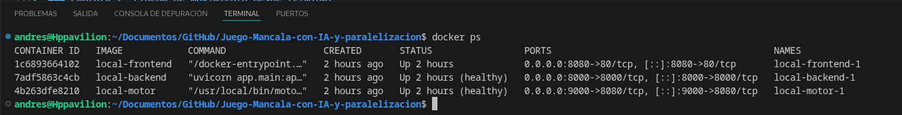
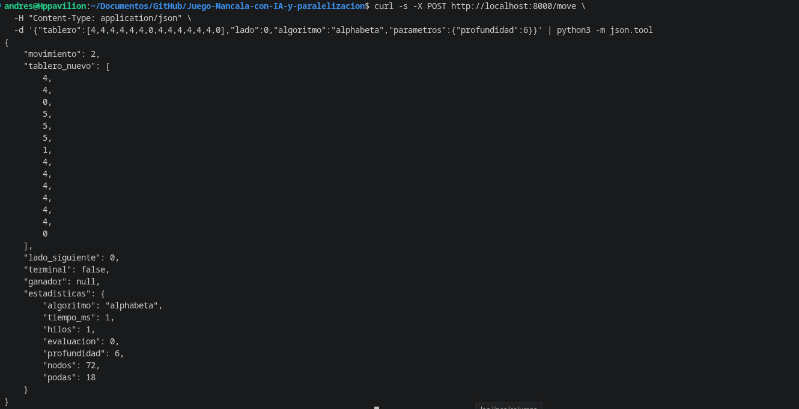
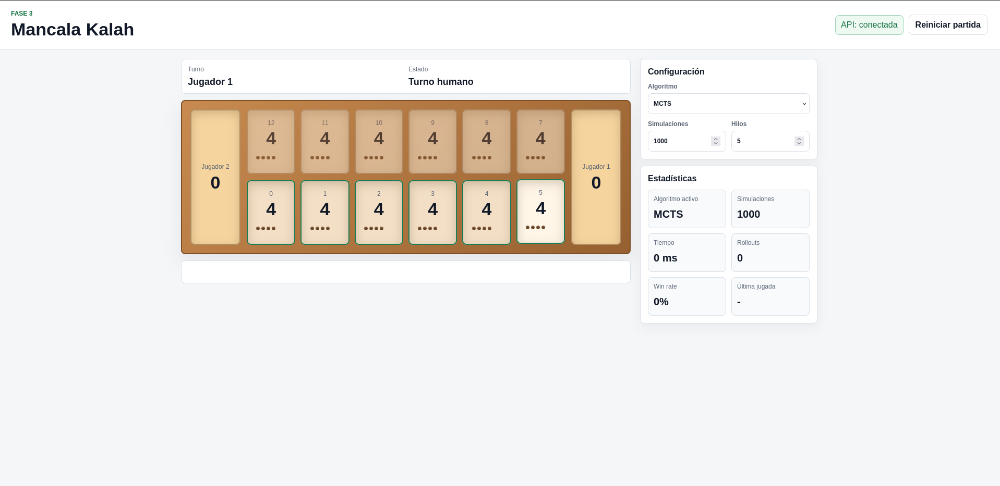
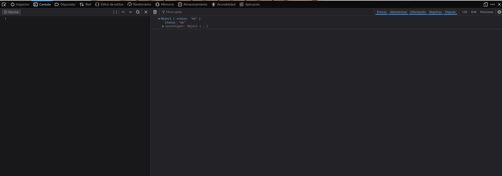
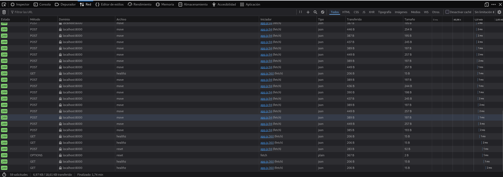
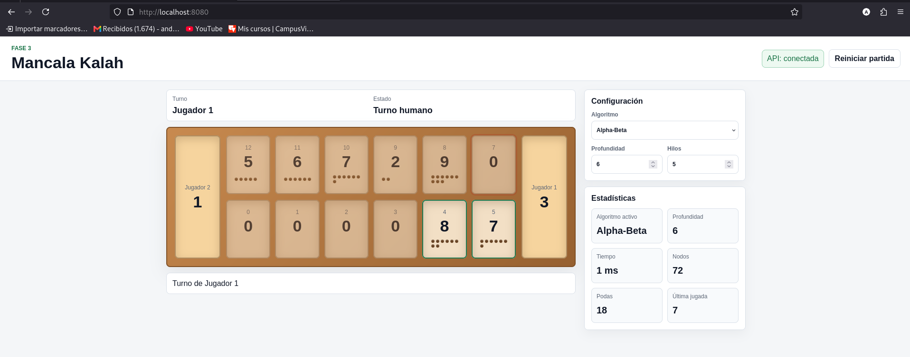
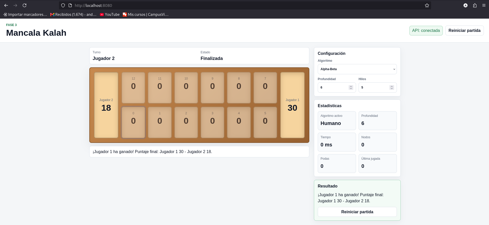
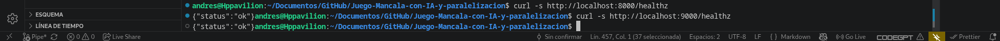

# 04 - Despliegue local

## Docker Compose

El archivo `deploy/local/docker-compose.yml` levanta los tres servicios del proyecto: `motor`, `backend` y `frontend`. Es la forma recomendada de reproducir la solucion completa en una maquina de desarrollo porque construye imagenes desde las carpetas evaluables y usa la red interna de Compose para que el backend hable con el motor.

Comando principal:

```bash
docker compose -f deploy/local/docker-compose.yml up --build
```

Puertos publicados:

- `9000`: motor C++ OpenMP, util para pruebas directas.
- `8000`: backend FastAPI.
- `8080`: frontend web servido por Nginx.

El servicio `motor` ejecuta `motor_server`, que escucha de forma fija en `0.0.0.0:8080`, y define `OMP_NUM_THREADS=4`. Compose publica ese puerto como `9000` en el host (`9000:8080`) para no chocar con el frontend local en `8080`. El servicio `backend` define `MOTOR_URL=http://motor:8080`, `MOTOR_TIMEOUT_SECONDS=10` y `CORS_ORIGINS=http://localhost:8080,http://127.0.0.1:8080`. No se define una ruta de respuestas simuladas porque el motor real es parte obligatoria del camino principal. Si el motor no esta sano, el backend debe fallar readiness y no debe inventar una jugada.

## Healthchecks

Compose usa healthchecks para ordenar el arranque. El motor se considera sano cuando `curl -fsS http://localhost:8080/healthz` responde correctamente dentro del contenedor; desde el host se prueba con `http://localhost:9000/healthz`. El backend se considera sano cuando una llamada local a `http://127.0.0.1:8000/healthz` responde. El frontend depende de que el backend este sano antes de arrancar.

Esta configuracion no garantiza que todo el trafico real este perfecto, pero reduce errores comunes: backend arrancando antes de que el motor escuche, frontend servido mientras la API aun no esta lista, o pruebas manuales ejecutadas en medio de la construccion.

## Pruebas manuales con curl

Con el stack arriba, primero se prueban endpoints de salud:

```bash
curl -s http://localhost:9000/healthz
curl -s http://localhost:9000/readyz
curl -s http://localhost:8000/healthz
curl -s http://localhost:8000/readyz
```

Luego se prueba el contrato principal por el backend:

```bash
curl -s -X POST http://localhost:8000/move \
  -H "Content-Type: application/json" \
  -d '{"board":[4,4,4,4,4,4,0,4,4,4,4,4,4,0],"side":0,"algo":"alphabeta","depth":8,"threads":4}'
```

La misma prueba puede enviarse directo al motor para aislar problemas:

```bash
curl -s -X POST http://localhost:9000/move \
  -H "Content-Type: application/json" \
  -d '{"board":[4,4,4,4,4,4,0,4,4,4,4,4,4,0],"side":0,"algo":"alphabeta","depth":8,"threads":4}'
```

Para probar MCTS por el backend:

```bash
curl -s -X POST http://localhost:8000/move \
  -H "Content-Type: application/json" \
  -d '{"board":[4,4,4,4,4,4,0,4,4,4,4,4,4,0],"side":0,"algo":"mcts","simulations":1000,"threads":4}'
```

Si directo al motor funciona y por backend no, el problema esta en `MOTOR_URL`, red de Compose o timeout. Si ambos fallan, el problema esta en motor, contrato JSON o tablero invalido. Si `/readyz` del backend devuelve `503`, el backend no puede contactar el motor.

## Validaciones esperadas

Una solicitud invalida debe fallar. Por ejemplo, un tablero con 13 posiciones debe producir error de schema en backend:

```bash
curl -i -X POST http://localhost:8000/move \
  -H "Content-Type: application/json" \
  -d '{"board":[4,4,4,4,4,4,0,4,4,4,4,4,4],"side":0,"algo":"alphabeta","depth":8,"threads":4}'
```

Un tablero con 14 posiciones pero total distinto de 48 tambien falla. Esta regla evita que el motor explore posiciones imposibles. En una herramienta de analisis se podria permitir cualquier tablero, pero el proyecto modela partidas de Kalah(6,4), asi que el total de semillas es parte del contrato.

## Frontend local

El frontend esta disponible en `http://localhost:8080`. Por defecto llama al backend en `http://localhost:8000`. La UI permite editar el arreglo del tablero, seleccionar `side`, algoritmo, `depth` o `simulations`, `threads`, y enviar la solicitud. Tambien pinta stores y pits para que sea mas facil detectar errores de indices. El navegador solo puede llamar al backend si CORS permite explicitamente el origen local; por eso el backend configura `http://localhost:8080` y `http://127.0.0.1:8080` en lugar de `"*"`.

## Kubernetes local (kind)

Los manifiestos estan en `deploy/local/k8s/`:

- `configmap.yaml`: `MOTOR_URL=http://motor-svc:8080`, `USE_MOCK=false`, `OMP_NUM_THREADS`, `DEFAULT_DEPTH`, CORS y timeouts.
- `motor.yaml`: Deployment (2 replicas) y Service `motor-svc` (ClusterIP, puerto 8080).
- `backend.yaml`: Deployment con **3 replicas** y Service `backend` (NodePort).
- `frontend.yaml`: Deployment (2 replicas) y Service `frontend` (NodePort `30080`).

### 1. Cluster e imagenes (GHCR)

Los Deployments en `deploy/local/k8s/` referencian imágenes publicadas en GHCR con tag **SHA del commit** (sin `:latest`), por ejemplo:

`ghcr.io/juandavidturriago/mancala-motor:54835ea9507d0d7d2e74902481962420f051438f`

El job `publish` de CI corre en `push` a `main` o `Bryan`; el tag debe coincidir con el commit publicado.

Con **kind**, no hace falta pull de GHCR si las imágenes se construyen localmente y se cargan al nodo:

```bash
export SHA=54835ea9507d0d7d2e74902481962420f051438f
export OWNER=juandavidturriago

kind create cluster --name mancala

kind load docker-image ghcr.io/${OWNER}/mancala-motor:${SHA} --name mancala
kind load docker-image ghcr.io/${OWNER}/mancala-backend:${SHA} --name mancala
kind load docker-image ghcr.io/${OWNER}/mancala-frontend:${SHA} --name mancala
```

Si el clúster debe hacer pull directo desde GHCR (sin `kind load`), crear el secret con un PAT `read:packages` (plantilla en `deploy/local/k8s/ghcr-secret.yaml.example`):

```bash
kubectl create secret docker-registry ghcr-credentials \
  --docker-server=ghcr.io \
  --docker-username=<GITHUB_USER> \
  --docker-password=<PAT_con_read:packages>
```

### 2. Aplicar manifiestos

```bash
kubectl apply -f deploy/local/k8s/
kubectl rollout status deployment/motor
kubectl rollout status deployment/backend
kubectl rollout status deployment/frontend
```

Orden equivalente por archivo:

```bash
kubectl apply -f deploy/local/k8s/configmap.yaml
kubectl apply -f deploy/local/k8s/motor.yaml
kubectl apply -f deploy/local/k8s/backend.yaml
kubectl apply -f deploy/local/k8s/frontend.yaml
```

### 3. Verificacion de pods y replicas

Todos los pods deben quedar en `Running` y `READY 1/1`:

```bash
kubectl get pods
kubectl get svc
kubectl get deployments
kubectl get deployment backend
```

Evidencia de despliegue en cluster `mancala` (motor real, backend **3/3 READY**):


Salida textual de referencia:

```text
$ kubectl get deployment backend
NAME      READY   UP-TO-DATE   AVAILABLE   AGE
backend   3/3     3            3           38h

$ kubectl get pods
NAME                        READY   STATUS    RESTARTS   AGE
backend-d4cc8974d-4bqwv     1/1     Running   0          117s
backend-d4cc8974d-h5gqh     1/1     Running   0          103s
backend-d4cc8974d-k69zm     1/1     Running   0          110s
frontend-8648f46b7b-fz74l   1/1     Running   0          2m45s
frontend-8648f46b7b-sbpw7   1/1     Running   0          2m52s
motor-5cd9c6b857-48hl2      1/1     Running   0          2m45s
motor-5cd9c6b857-8g2qh      1/1     Running   0          2m52s
```

### 4. Probes del backend

```bash
kubectl describe pod $(kubectl get pods -l app=backend -o jsonpath='{.items[0].metadata.name}')
```

Debe listar `Liveness` en `/healthz` y `Readiness` en `/readyz` (puerto 8000). Al final, `Conditions` con `Ready: True`. Un aviso transitorio de readiness al arrancar (mientras el motor aun no responde) es normal; si persiste, el pod entra en `CrashLoopBackOff` y conviene revisar logs del backend y del motor.

### 5. Red interna backend → motor

Desde un pod del backend (el contenedor no trae `curl`; usar Python):

```bash
kubectl exec deploy/backend -- python -c "import urllib.request; print(urllib.request.urlopen('http://motor-svc:8080/healthz', timeout=5).read().decode())"
```

Respuesta esperada: `{"status":"ok"}`.

### 6. Acceso desde el host

```bash
kubectl port-forward svc/backend 8000:8000
curl -s http://localhost:8000/readyz
```

Frontend (requiere también port-forward del backend en `:8000` porque la UI llama a `http://localhost:8000`):

```bash
kubectl port-forward svc/backend 8000:8000
kubectl port-forward svc/frontend 8080:80
```

Luego abrir `http://localhost:8080`. Si el puerto 8080 del host ya está ocupado (por ejemplo por un contenedor Docker previo), liberarlo antes del port-forward o usar otro puerto local (`8081:80`).

Prueba de humo del flujo humano + motor real por API (mismos servicios del cluster vía port-forward):

```bash
curl -s -X POST http://localhost:8000/move \
  -H "Content-Type: application/json" \
  -d '{"tablero":[4,4,4,4,4,4,0,4,4,4,4,4,4,0],"lado":0,"movimiento":1,"algoritmo":"alphabeta","parametros":{"profundidad":4,"hilos":2}}'

curl -s -X POST http://localhost:8000/move \
  -H "Content-Type: application/json" \
  -d '{"tablero":[4,0,5,5,5,5,0,4,4,4,4,4,4,0],"lado":1,"algoritmo":"alphabeta","parametros":{"profundidad":4,"hilos":2}}'
```

La respuesta del motor debe incluir `estadisticas.nodos > 0` (Alpha-Beta real, no mock).

## Diagnostico

Si un pod queda en `ImagePullBackOff`, probablemente la imagen local no fue cargada al cluster kind o el nombre no coincide con el manifiesto. Si el backend queda `Running` pero `readyz` falla, revisar logs:

```bash
kubectl logs deployment/backend --tail=200
kubectl logs deployment/motor --tail=200
```

Si el motor arranca pero las busquedas tardan demasiado, bajar `depth`, `simulations` o `threads` en la solicitud. Para pruebas de humo se recomienda `depth=4` en Alpha-Beta o `simulations=1000` en MCTS; para evidencia de rendimiento se recomienda `depth=8` o superior, siempre observando los recursos disponibles.

## Limpieza

Para detener Compose:

```bash
docker compose -f deploy/local/docker-compose.yml down
```

Para eliminar el cluster kind:

```bash
kind delete cluster --name mancala
```

Estos comandos no eliminan el codigo ni modifican la plantilla; solo limpian procesos y recursos locales.

## Guia de pruebas

Si ademas de desplegar necesitas una lista ordenada de comandos para validar el motor, el backend, el frontend y el flujo completo, revisa [TESTING.md](../TESTING.md).

## Dockerfiles

### Frontend Dockerfile (`frontend/Dockerfile`)

```dockerfile
# Usa imagen oficial de Nginx basada en Alpine Linux (~23MB)
FROM nginx:1.27-alpine

# Copia el archivo HTML principal al directorio servido por Nginx
COPY index.html /usr/share/nginx/html/index.html

# Copia la lógica JavaScript del frontend
COPY app.js /usr/share/nginx/html/app.js

# Copia los estilos CSS
COPY style.css /usr/share/nginx/html/style.css

# Copia configuración personalizada de Nginx (proxy, CORS, etc.)
COPY nginx.conf /etc/nginx/conf.d/default.conf

# Expone el puerto 80 (interno del contenedor)
EXPOSE 80
# Nota: No hay CMD porque nginx:alpine ya tiene uno por defecto
```

### Backend Dockerfile (`backend/Dockerfile`)

```dockerfile
# Usa Python 3.11 slim (~150MB, más ligero que full)
FROM python:3.11-slim

# Evita generar archivos .pyc (reduce espacio)
ENV PYTHONDONTWRITEBYTECODE=1
# Evita buffer de stdout (logs en tiempo real)
ENV PYTHONUNBUFFERED=1

# Establece directorio de trabajo dentro del contenedor
WORKDIR /app

# Copia solo requirements.txt primero (optimiza cache de Docker)
COPY requirements.txt ./requirements.txt

# Instala dependencias sin cache y crea usuario no-root
RUN pip install --no-cache-dir -r requirements.txt \
 && useradd -r -u 1001 api

# Copia todo el código fuente de la app
COPY app ./app

# Variables de entorno por defecto (pueden sobreescribirse)
ENV MOTOR_URL=http://motor:8080
ENV MOTOR_TIMEOUT_SECONDS=10
ENV USE_MOCK=false
ENV CORS_ORIGINS=http://localhost:8080,http://127.0.0.1:8080,http://frontend

# Expone puerto de FastAPI
EXPOSE 8000

# Cambia a usuario no-root (mejora seguridad)
USER api

# Comando para iniciar el servidor Uvicorn
CMD ["uvicorn", "app.main:app", "--host", "0.0.0.0", "--port", "8000"]
```

### Motor Dockerfile (`motor/Dockerfile`)

```dockerfile
# ==================== ETAPA 1: COMPILACIÓN ====================
FROM ubuntu:24.04 AS builder

# Instala herramientas de compilación
RUN apt-get update && apt-get install -y --no-install-recommends \
    build-essential \
    cmake \
    g++ \
    libgomp1 \
 && rm -rf /var/lib/apt/lists/*

# Establece directorio de trabajo
WORKDIR /src

# Copia archivos de configuración y código fuente
COPY CMakeLists.txt ./
COPY src ./src
COPY tests ./tests
COPY bench ./bench

# Configura y compila en modo Release con todos los núcleos
RUN cmake -S . -B build -DCMAKE_BUILD_TYPE=Release \
 && cmake --build build -j \
 && ctest --test-dir build --output-on-failure

# ==================== ETAPA 2: RUNTIME ====================
FROM ubuntu:24.04 AS runtime

# Instala runtime libraries (libgomp1 para OpenMP, curl para healthchecks)
RUN apt-get update && apt-get install -y --no-install-recommends \
    curl \
    libgomp1 \
 && rm -rf /var/lib/apt/lists/* \
 && useradd -r -u 1001 motor

WORKDIR /app

# Copia binarios compilados desde la etapa builder
COPY --from=builder /src/build/motor_server /usr/local/bin/motor_server
COPY --from=builder /src/build/bench /usr/local/bin/bench
COPY tests/suite.txt /app/tests/suite.txt

# Configura número de hilos OpenMP por defecto
ENV OMP_NUM_THREADS=4

# Expone puerto del servidor
EXPOSE 8080

# Cambia a usuario no-root
USER motor

# Inicia el servidor HTTP del motor
CMD ["/usr/local/bin/motor_server"]
```

## docker-compose.yml 

```yaml
services:
  # ==================== MOTOR IA (C++) ====================
  motor:
    build:
      context: ../../motor          # Ruta al directorio con Dockerfile y código
    environment:
      OMP_NUM_THREADS: "4"          # Hilos OpenMP para paralelización
    ports:
      - "9000:8080"                 # Mapea puerto host 9000 → contenedor 8080
    healthcheck:
      test: ["CMD", "curl", "-fsS", "http://localhost:8080/healthz"]
      interval: 5s                  # Verifica cada 5 segundos
      timeout: 3s                   # Timeout por verificación
      retries: 10                   # Reintentos antes de marcar unhealthy
      start_period: 5s              # Espera inicial antes de empezar healthchecks

  # ==================== BACKEND (FastAPI) ====================
  backend:
    build:
      context: ../../backend        # Ruta al directorio con Dockerfile y código
    ports:
      - "8000:8000"                 # Mapea puerto host 8000 → contenedor 8000
    environment:
      MOTOR_URL: "http://motor:8080"           # URL interna al motor
      MOTOR_TIMEOUT_SECONDS: "10"              # Timeout para peticiones al motor
      USE_MOCK: "false"                        # El despliegue normal usa el motor real
      CORS_ORIGINS: "http://localhost:8080,http://127.0.0.1:8080,http://frontend"
    depends_on:
      motor:
        condition: service_healthy  # Espera a que motor esté saludable
    healthcheck:
      test: ["CMD", "python", "-c", "import urllib.request; urllib.request.urlopen('http://127.0.0.1:8000/healthz')"]
      interval: 5s
      timeout: 3s
      retries: 10
      start_period: 5s

  # ==================== FRONTEND (Nginx) ====================
  frontend:
    build:
      context: ../../frontend        # Ruta al directorio con archivos estáticos
    ports:
      - "8080:80"                    # Mapea puerto host 8080 → contenedor 80
    depends_on:
      backend:
        condition: service_healthy   # Espera a que backend esté saludable
    # Nota: frontend no tiene healthcheck propio en este compose
```


### Captura 1: Contenedores Docker funcionando




### Captura 2: Prueba de movimiento desde terminal



### Captura 3: Frontend funcionando en navegador


### Captura 4: DevTools - Sin errores CORS



### Captura 5: DevTools - Network con petición exitosa



### Captura 6: Panel de estadísticas actualizado



### Captura 7: Fin de juego detectado



### Captura 8: Health checks exitosos



## Resumen de Comandos Útiles

| Propósito | Comando |
|-----------|---------|
| Levantar todo | `docker compose -f deploy/local/docker-compose.yml up --build` |
| Ver contenedores | `docker ps` |
| Ver logs backend | `docker compose -f deploy/local/docker-compose.yml logs backend` |
| Ver logs motor | `docker compose -f deploy/local/docker-compose.yml logs motor` |
| Probar backend | `curl http://localhost:8000/healthz` |
| Probar motor | `curl http://localhost:9000/healthz` |
| Detener todo | `docker compose -f deploy/local/docker-compose.yml down` |
| Limpiar todo (incluye volúmenes) | `docker compose -f deploy/local/docker-compose.yml down -v` |
