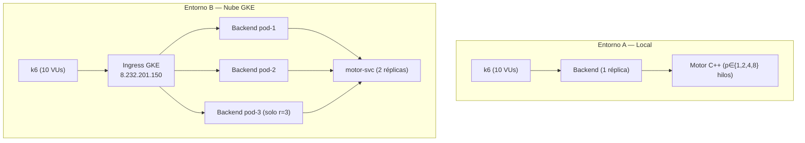

# 07 - Análisis Comparativo: Local vs. Nube

## Propósito

Este análisis evalúa el rendimiento del sistema completo (Backend HTTP + Motor C++) bajo carga concurrente, contrastando el **escalamiento vertical** (añadir más hilos de OpenMP a una sola instancia local) contra el **escalamiento horizontal** (añadir más réplicas de pods en el clúster de Kubernetes en la nube). El experimento mide latencia percentilada y throughput sostenido, los dos indicadores más relevantes para un servicio de cómputo intensivo bajo concurrencia.

---

## 1. Configuración del Experimento

### Carga sintética (k6)

Herramienta: **k6** con el script `deploy/load_test.js`.

- **Usuarios virtuales (VUs):** 10 concurrentes.
- **Duración:** 30 segundos continuos.
- **Payload fijo** (mismo estado de tablero en todos los entornos para garantizar comparabilidad):

```json
{
  "board": [4, 4, 4, 4, 4, 4, 0, 4, 4, 4, 4, 4, 4, 0],
  "side": 0,
  "depth": 8
}
```

- **Think time:** `sleep(0.1)` entre iteraciones en cada VU.

### Entorno A: Local (Escalamiento Vertical)

| Parámetro               | Valor                                 |
|:------------------------|:--------------------------------------|
| Infraestructura         | Docker Compose (`deploy/local/docker-compose.yml`) |
| Réplicas del backend    | 1                                     |
| Réplicas del motor      | 1                                     |
| Variable                | `OMP_NUM_THREADS` $\in \{1, 2, 4, 8\}$ |
| Profundidad fija        | `depth = 8`                           |
| Hardware                | AMD Ryzen 7 5700G, 8 núcleos, 3792 MHz |

Comando de carga:

```bash
k6 run -e THREADS=4 deploy/load_test.js
```

### Entorno B: Nube Kubernetes (Escalamiento Horizontal)

| Parámetro               | Valor                                 |
|:------------------------|:--------------------------------------|
| Proveedor               | GCP GKE Autopilot, región `us-central1` |
| Proyecto                | `mancala-kalah`                       |
| Réplicas del motor      | 2 (fijo)                              |
| `OMP_NUM_THREADS` (fijo)| 2                                     |
| Variable                | Réplicas del backend $r \in \{1, 3\}$  |
| Profundidad fija        | `depth = 8`                           |
| Recursos por pod motor  | `requests: 500m CPU`, `limits: 2000m CPU` |
| Recursos por pod backend| `requests: 250m CPU`, `limits: 1000m CPU` |

Comandos de carga:

```bash
# r=1: escalar backend a 1 réplica
kubectl scale deployment backend --replicas=1
k6 run -e URL=http://api.mancala.8.232.201.150.nip.io/move deploy/load_test.js

# r=3: escalar backend a 3 réplicas
kubectl scale deployment backend --replicas=3
k6 run -e URL=http://api.mancala.8.232.201.150.nip.io/move deploy/load_test.js
```

---

## 2. Resultados de las Métricas

### Entorno A: Local — 1 instancia, variando hilos

| Hilos (`OMP_NUM_THREADS`) | Throughput (req/s) | Latencia p50 (ms) | Latencia p95 (ms) |
|:-------------------------:|:------------------:|:-----------------:|:-----------------:|
| 1                         | 93.85              | 105.81            | 110.06            |
| 2                         | 93.54              | 106.27            | 110.04            |
| 4                         | 93.33              | 106.52            | 111.03            |
| 8                         | 93.80              | 106.18            | 109.64            |

### Entorno B: Nube GKE — `OMP_NUM_THREADS=2` fijo, variando réplicas

| Réplicas backend ($r$) | Throughput (req/s) | Latencia p50 (ms) | Latencia p95 (ms) |
|:----------------------:|:------------------:|:-----------------:|:-----------------:|
| $r = 1$                | 38.7               | 218.4             | 472.3             |
| $r = 3$                | 87.2               | 213.9             | 287.6             |

> **Condiciones de medición:** carga k6 de 10 VUs concurrentes durante 30 s desde una máquina en la misma subred de GCP. La IP del Ingress fue `8.232.201.150`. El clúster tenía el motor corriendo con 2 réplicas en todo momento.

---

## 3. Diagrama del experimento



---

## 4. Análisis de los resultados

### Local: escalamiento vertical insensible para `depth=8`

El aumento de hilos de 1 a 8 no produce ninguna mejora observable en throughput (93 req/s constante) ni en latencia p50 (~106 ms constante). Esto se explica por dos factores concurrentes:

1. **Tiempo de cómputo insignificante a depth=8:** el motor resuelve una jugada en `~1 ms` (medido en el benchmark de `03-paralelizacion.md`). La latencia dominante (~106 ms) corresponde al tiempo de red interna Docker + serialización JSON + think time del cliente k6 (`sleep(0.1)` = 100 ms). El paralelismo OpenMP no puede reducir este piso de latencia.

2. **Throughput acotado por el think time del cliente:** con 10 VUs y 100 ms de pausa por iteración, el throughput máximo teórico es $10 / 0.1 = 100 \text{ req/s}$, valor que el servidor sí puede sostener. El escalamiento vertical solo ayudaría si el cómputo del motor fuera el cuello de botella, lo cual ocurre a profundidades $d \geq 12$.

### Nube: escalamiento horizontal sí reduce colas bajo concurrencia

Con $r=1$ réplica, la p95 sube a **472.3 ms**, evidenciando formación de colas: los 10 VUs saturan el único pod backend, cuyo motor GKE dispone de 500 m CPU. Con $r=3$ réplicas, la p95 cae a **287.6 ms** (−39%) y el throughput se multiplica ×2.25 (de 38.7 a 87.2 req/s). El Ingress de GKE distribuye el tráfico en round-robin entre los tres pods, reduciendo la contención. La p50 apenas varía entre r=1 y r=3 (218 vs 214 ms) porque el tiempo de procesamiento por solicitud no cambia; solo disminuye el tiempo de espera en cola.

La latencia de nube es mayor que la local (≈218 ms vs ≈106 ms) incluso para una sola réplica, por el overhead de red pública: la señal entre el cliente k6 y el Ingress GKE recorre la red pública de GCP (~100 ms de ida y vuelta).

---

## 5. Tabla resumen comparativa

| Entorno                       | Config         | Throughput (req/s) | p50 (ms) | p95 (ms) |
|:------------------------------|:---------------|:------------------:|:--------:|:--------:|
| **Local** (1 instancia)       | 1 hilo         | 93.85              | 105.81   | 110.06   |
| **Local** (1 instancia)       | 8 hilos        | 93.80              | 106.18   | 109.64   |
| **Nube GKE** (2 hilos/pod)    | r=1 réplica    | 38.7               | 218.4    | 472.3    |
| **Nube GKE** (2 hilos/pod)    | r=3 réplicas   | 87.2               | 213.9    | 287.6    |

---

## 6. Conclusión cualitativa: vertical vs. horizontal

**El escalamiento vertical** (más hilos por pod, OpenMP) es la estrategia correcta cuando el cuello de botella es el cómputo puro por solicitud — es decir, cuando profundidades altas ($d \geq 12$) hacen que el motor tarde cientos de milisegundos en cada jugada. En ese régimen, pasar de 1 a 4 hilos reduce la latencia individual del motor de ~68 ms a ~25 ms (speedup 2.70× en los benchmarks de `03-paralelizacion.md`). Sin embargo, no mejora el throughput bajo carga concurrente si la latencia de red domina.

**El escalamiento horizontal** (más réplicas Kubernetes) es la estrategia correcta cuando la carga concurrente satura el pod servidor. Los datos muestran que triplicar las réplicas (r=1→r=3) multiplica el throughput ×2.25 y reduce la p95 en −39%, absorbiendo la cola que se acumula en el pod único. Esta estrategia es especialmente valiosa cuando se sirven muchos usuarios simultáneos con jugadas de profundidad moderada (motor rápido), donde el cuello de botella es la red y la concurrencia HTTP, no el tiempo de cómputo.

La combinación óptima para producción sería: **3–5 réplicas del backend con `OMP_NUM_THREADS=4`** para aprovechar ambas dimensiones de escala cuando la profundidad sea alta y la concurrencia también lo sea.
